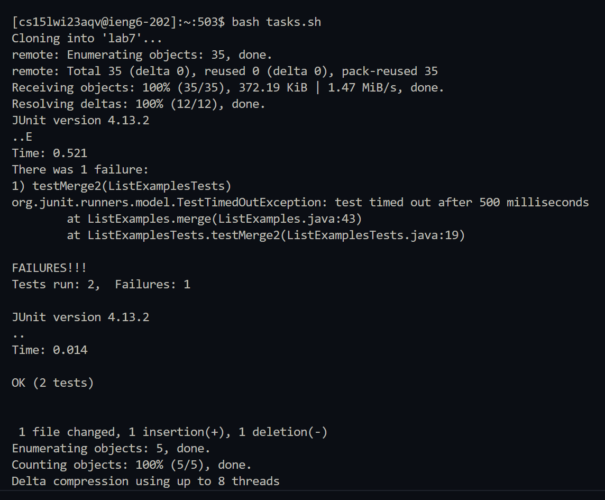
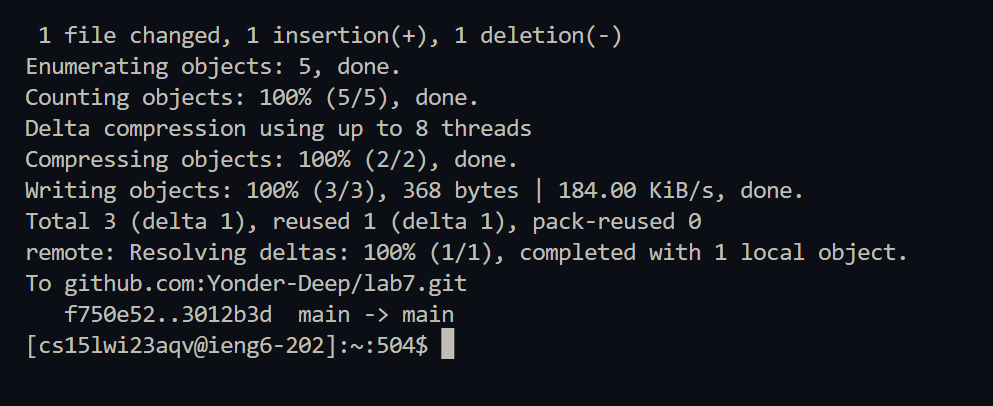

# Lab Report 5

## Optimizing Lab Report 4 using a Bash Script

This lab report will take a closer look at the sequence of commands that we ran in lab report 4. I will make use of a bashscript to make all the commands run together instead of typing them in the terminal and running them individually. This will save a lot of time and work at a very fast speed every time.

**Note:** We will assume that the fork of the repository exists in our github account. 

### Steps to be completed

As a reminder, here are the following tasks:

1. Setup Delete any existing forks of the repository you have on your account
2. Setup Fork the repository
3. The real deal Start the timer!
4. Log into ieng6
5. Clone your fork of the repository from your Github account
6. Run the tests, demonstrating that they fail
7. Edit the code file to fix the failing test
8. Run the tests, demonstrating that they now succeed
9. Commit and push the resulting change to your Github account (you can pick any commit message!)

As I did in the last report, over here we will start from step 4 and assume that the setup is already completed.

### Making the bash script

I wrote a bash script to carry out all the tasks simultaneously. At the start I tried including the `ssh` command in the bash script but realized that it will stop running when I'm in the remote server and resume when I run it locally. Hence, I first logged into the remote server using `ssh cs15lwi23aqv@ieng6.ucsd.edu` command annd then ran the bash script in the ieng6 server. Here is the code for the bash script:

```
# Cloning the repository
git clone git@github.com:Yonder-Deep/lab7.git
# Changing directory to lab7
cd lab7

# Compiling and running the tester (which gives an error)
javac -cp .:lib/hamcrest-core-1.3.jar:lib/junit-4.13.2.jar *.java
java -cp .:lib/hamcrest-core-1.3.jar:lib/junit-4.13.2.jar org.junit.runner.JUnitCore ListExamplesTests

# Editting the text file using sed
sed -i '43s/index1/index2/g' ListExamples.java

# Compiling and running the tester (all tests pass)
javac -cp .:lib/hamcrest-core-1.3.jar:lib/junit-4.13.2.jar *.java
java -cp .:lib/hamcrest-core-1.3.jar:lib/junit-4.13.2.jar org.junit.runner.JUnitCore ListExamplesTests

# Adding, committing, and pushing the changes
git add ListExamples.java
git commit -m "[FIXED] Error in code"
git push
```

Here is what this bash script does step-by-step.

1. Cloning the repository using the `git clone` command.
2. Changing directory to `lab7` where all the files are stored.
3. Compiling and running the files using the `javac` and `java` commands. Running this command should give an output of failed JUnit tests.
4. This step was important since it editted the file without using the `nano` command. I wanted to look for a way to edit files using a bash script and found a powerful command called `sed`. This command `sed -i '43s/index2/index1/g' ListExamples.java` goes to line 43 in 'ListExamples.java' and replaces 'index1' with 'index2'. This fixes the bug of an infinite loop and makes sure the tests pass.
5. Compiling and running the files using the `javac` and `java` commands. Running this command should now give an output of all JUnit tests passing.
6. Using `git add`, `git commit`, and `git push` to save the changes to GitHub.

All of these commmands worked successfully and the output could be seen in the terminal. Creating a bashscript made the entire process much more faster and made me realize the power of how useful these scripts can be in carrying out complicated tasks such as these.

### Explanation of certain steps

I ran the bash script by running `bash tasks.sh` in my ieng6 terminal. Here is what the output looked like:





This output shows the repository being cloned, running the JUnit tests (showing that they failed), running them once again after the change is made (showing that they passed) and then committing and pushing all the changes to Github. 

The `sed` command is run internally and has no visibile output in the terminal such as opening up the nano editor or making any changes to the files specified. 

## Conclusion

This lab report showed me how powerful writing a bashscript is. Learning how to used `sed` which we didn't do the first time was very useful as well and is definitely something that I will use while writing bash scripts in the future. All in all, I got a chance to look back and reflect upon making the whole process more efficient and learnt some new things along the way.
